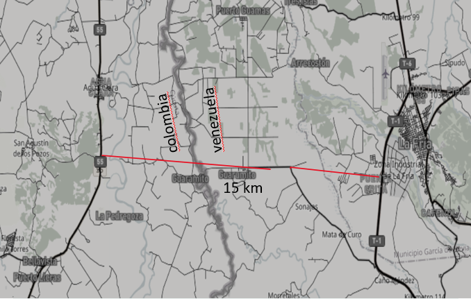
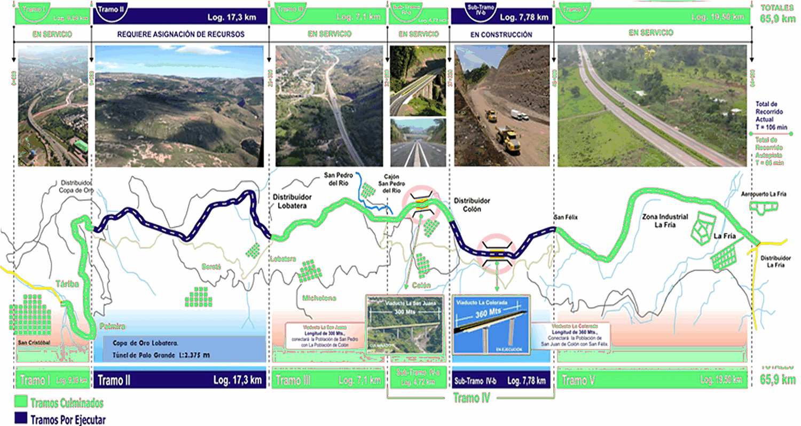

# Correcciones · Landing Táchira 2030

Paquete de cambios para que el desarrollador los aplique al landing
(`Pagina Web Tachira 2030.html`). Todos los cambios provienen de la versión
**final** de la presentación del Ing. Simón Ballesteros (junio 2026).

> El landing usa HTML plano + `landing.css` (variables CSS ya definidas:
> `--gold`, `--line`, `--steel`, `--paper-3`, `--white`, `--mono`, etc.).
> No hace falta CSS nuevo: las dos figuras nuevas usan estilos en línea con
> esas variables.

---

## Archivos incluidos en este paquete

```
Pagina Web Tachira 2030.html   ← landing YA corregido (referencia)
landing.css                    ← sin cambios respecto al original (incluido por completitud)
assets/mapa-eje2.png           ← IMAGEN NUEVA (mapa binacional Guarumito)
assets/trazado-corredor.png    ← IMAGEN NUEVA (infografía del trazado)
```

Las demás imágenes del landing (`sancristobal.jpg`, `mapa-tachira.png`,
`autopista.jpg`, `render-hub.png`, `puerto-seco.jpg`, `tren.jpg`) **no cambian**.

---

## Resumen de cambios (5)

| # | Sección | Tipo | Cambio |
|---|---------|------|--------|
| 1 | Propuesta · Ejes | Texto | Nombre completo del Eje 2 |
| 2 | Propuesta · Ejes | Imagen | Mapa binacional de Guarumito (nuevo) |
| 3 | Proyecto bandera | Dato | Fila "Túnel Palo Grande · 2 × 2.500 m" |
| 4 | Proyecto bandera | Imagen | Infografía del trazado del corredor (nueva) |
| 5 | Hoja de ruta | Texto | "Rehabilitar tramos I, III y V" en mediano plazo |

---

## 1 · Eje 2 — nombre completo

En la tarjeta `EJE 2` dentro de `.ejes`:

**Antes**
```html
<div class="tag">EJE 2</div><h3>La Fría – Cúcuta</h3><div class="desc">Vía expresa doble calzada · 65 km</div>
```
**Después**
```html
<div class="tag">EJE 2</div><h3>La Fría – Guarumito – Agua Clara – Cúcuta</h3><div class="desc">Vía expresa doble calzada · 65 km</div>
```

---

## 2 · Mapa binacional de Guarumito (imagen nueva)

Agregar esta `<figure>` **justo después** del `</div>` que cierra `.ejes`
y **antes** del `</div></section>` de la sección `#propuesta`.

Requiere la imagen nueva `assets/mapa-eje2.png`.

```html
<figure class="reveal" style="margin:44px auto 0;max-width:940px;border:1px solid var(--line);border-radius:8px;overflow:hidden;background:var(--white);">
  
  <figcaption style="font-family:var(--mono);font-size:13px;letter-spacing:.04em;color:var(--steel);padding:15px 22px;border-top:1px solid var(--line);background:var(--paper-3);">Eje 2 · cruce binacional La Fría – Guarumito – Agua Clara – Cúcuta · frontera Venezuela – Colombia</figcaption>
</figure>
```

---

## 3 · Proyecto bandera — fila "Túnel Palo Grande"

Dentro de `.star .body .rows`, agregar una fila entre "Tramo II" y "Tramo IVb".

**Antes**
```html
<div class="srow"><span>Tramo II · Copa de Oro – Lobatera</span><b>$499,8 M</b></div>
<div class="srow"><span>Tramo IVb · Viaducto La Colorada</span><b>$207,9 M</b></div>
```
**Después**
```html
<div class="srow"><span>Tramo II · Copa de Oro – Lobatera</span><b>$499,8 M</b></div>
<div class="srow"><span>Túnel Palo Grande</span><b>2 × 2.500 m</b></div>
<div class="srow"><span>Tramo IVb · Viaducto La Colorada</span><b>$207,9 M</b></div>
```

---

## 4 · Infografía del trazado (imagen nueva)

Agregar esta `<figure>` **justo después** del `</div>` que cierra `.star`
y **antes** del `</div></section>` de la sección del proyecto bandera.

Requiere la imagen nueva `assets/trazado-corredor.png`.

```html
<figure class="reveal" style="margin-top:32px;border:1px solid var(--line);border-radius:8px;overflow:hidden;background:var(--white);">
  
  <figcaption style="font-family:var(--mono);font-size:13px;letter-spacing:.04em;color:var(--steel);padding:15px 22px;border-top:1px solid var(--line);background:var(--paper-3);">Trazado del corredor · 5 tramos · túnel Palo Grande 2 × 2.500 m · viaductos hasta H = 64 m · Viaducto La Colorada 359 m</figcaption>
</figure>
```

---

## 5 · Hoja de ruta — Mediano plazo

En la fase "Mediano plazo" (`#ruta .road`), agregar un `<li>` al final de la lista.

**Antes**
```html
<div class="ph-h"><b>Mediano plazo</b><span>1–3 años</span></div><ul><li>Iniciar obras Tramo II</li><li>Completar Viaducto La Colorada</li><li>Pista La Fría a 2.500 m</li><li>Básculas en 4 pasos fronterizos</li></ul>
```
**Después**
```html
<div class="ph-h"><b>Mediano plazo</b><span>1–3 años</span></div><ul><li>Iniciar obras Tramo II</li><li>Completar Viaducto La Colorada</li><li>Pista La Fría a 2.500 m</li><li>Básculas en 4 pasos fronterizos</li><li>Rehabilitar tramos I, III y V</li></ul>
```

---

## Pendiente opcional (no incluido)

La foto de la **báscula de pesaje fronterizo** (`pesaje-camion.jpg`) existe en
la presentación pero **no** se agregó al landing. Si se desea, puede sumarse
como bloque/pilar propio de "pesaje fronterizo". Indicar si se quiere incluir.
